# 🍺 Yodl Beer Frontend

[](https://www.typescriptlang.org/)
[](https://reactjs.org/)
[](https://vitejs.dev/)
[](https://tailwindcss.com/)

> A modern React application that connects crypto payments to physical beer dispensing through IoT integration. Part of a complete blockchain-to-beer ecosystem that transforms cryptocurrency transactions into freshly poured beverages. 🚀

## ✨ Features

- 🍻 **Browse beer taps by location** - Discover available beers at different venues
- 💳 **Crypto payment integration** - Seamless payments via Yodl Pay SDK
- ⚡ **Real-time status tracking** - Live updates with 1-second polling
- 🎨 **Glassmorphism design** - Modern, responsive UI with Tailwind CSS
- 📊 **Queue position updates** - Know exactly where you are in line
- 🔄 **Smart polling** - Stops polling on completion to save resources

## 🛠️ Tech Stack

| Technology | Purpose |
|------------|---------|
|  | Modern UI with TypeScript |
|  | Fast development and building |
|  | Router & Query for data fetching |
|  | Modern styling system |
|  | Beautiful UI components |
|  | Crypto payment integration |

## 🚀 Quick Start

```bash
# Clone the repository
git clone https://github.com/your-username/yodl-beer-frontend.git
cd yodl-beer-frontend

# Install dependencies
pnpm install

# Start development server
pnpm dev
```

Open [http://localhost:3000](http://localhost:3000) in your browser.

## 🧪 Development Commands

| Command | Description |
|---------|-------------|
| `pnpm dev` | Start development server |
| `pnpm build` | Build for production |
| `pnpm test` | Run test suite |
| `pnpm lint` | Check code quality |
| `pnpm format` | Format code with Prettier |
| `pnpx shadcn@latest add [component]` | Add UI components |

## 🗺️ Routes

| Route | Description |
|-------|-------------|
| `/` | Home page with location browser |
| `/location/[location]` | Beer taps with payment integration |

## 💳 Payment Flow


1. 🍺 **Browse** available beer taps at a location
2. 💰 **Pay** with crypto via Yodl Pay integration  
3. 📡 **Track** real-time status with beer-themed messaging
4. ⏳ **Queue** position updates for pending orders
5. ✅ **Enjoy** completion notification when ready

## 🏗️ System Architecture

This frontend is part of a complete **IoT beer dispensing ecosystem**:

### 🔗 Connected Components

<table>
<tr>
<td width="33%">

**🖥️ Frontend** *(This Repo)*
- React app for ordering
- Real-time status tracking  
- Crypto payment integration

</td>
<td width="33%">

**🔧 [Smart Beer Tap](https://github.com/MihkelJ/smart-beer-tap-system)**
- ESP32 hardware control
- Precise flow control (50ml-2L)
- Blynk IoT integration
- Safety mechanisms

</td>
<td width="33%">

**⚡ [Webhook Service](https://github.com/MihkelJ/yodl-store-webhook)**  
- Payment processing
- Transaction validation
- Hardware triggering
- Status API

</td>
</tr>
</table>

### 🔄 Complete Flow: Crypto → Beer

```mermaid
graph TD
    A[🍺 Customer browses taps] --> B[💳 Frontend initiates payment]
    B --> C[🔗 Yodl Pay processes transaction]
    C --> D[📡 Webhook validates payment]
    D --> E[🤖 Triggers ESP32 via Blynk]
    E --> F[🚰 Hardware dispenses beer]
    F --> G[📊 Frontend shows completion]
```



> **The result:** Cryptocurrency payments directly control physical beer dispensing with precision IoT hardware and real-time status updates.

---

## 🤝 Contributing

Contributions are welcome! Please feel free to submit a Pull Request.

## 📄 License

This project is licensed under the MIT License.

## 🌟 Built With Love

*The ultimate blockchain-to-beer experience!* 🍺⚡🚀